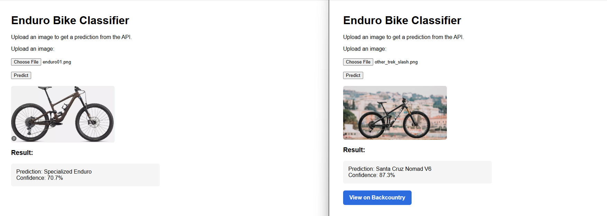

# Enduro Bike Classifier (Azure AI)

A deliberately constrained computer-vision MVP exploring whether product imagery
could improve marketplace listing accuracy. It classifies two visually similar
enduro mountain bike frames using an Azure Custom Vision model exported to ONNX,
and links a confirmed match to a retail product page.

The more useful result was not the classifier. It was discovering how
confidently a closed-set model misidentifies unfamiliar input — and how far the
platform's own accuracy metric diverged from performance on images it had never
seen.

Built to put AI-900 fundamentals into practice end to end: dataset design, model
training and evaluation, exported local inference, an API, a working interface,
and the product documentation around it.

**Status:** working local prototype. Complete and running; validated against
held-out images with mixed results — two of five clean passes. Last verified
2026-08-01.

**What it demonstrates:** commercial framing of an ML problem, model evaluation,
failure-mode discovery, and verification discipline around AI-assisted
development.

**What it does not demonstrate:** production readiness, open-world bike
recognition, or reliable fraud detection.

---

## Demo




*Left: a Specialized Enduro identified correctly at 70.7% confidence. Right: a
Trek Slash — neither of the two frames the model knows — identified as a Santa
Cruz Nomad V6 at 87.3%, with the retail link firing for a bike the user is not
looking at. Confidence is not correctness, and a closed-set classifier has no
way to say "neither." This is the failure mode the project set out to
characterise.*

---

## 1. Problem

Bike marketplace listings are frequently miscategorised or misdescribed, whether
through seller error or deliberate misrepresentation. That creates friction
across the board:

- **Buyers** get unreliable search results and reduced trust
- **Sellers** get incorrect categorisation and lower visibility
- **Support teams** verify listings by hand

Automated frame identification would address the root cause: it makes
categorisation a system property rather than something dependent on the seller
getting it right.

Adjacent applications — counterfeit detection, fraud heuristics,
marketplace-wide automation — are plausible extensions of the same capability.
They are hypotheses here, not demonstrated results; a two-class classifier does
not evidence them.

The commerce connection is the point of the demo. A confirmed match surfaces a
direct retail link. Identification alone is a classification exercise;
identification tied to a purchase path is a merchandising capability.

## 2. What this demonstrates

- Framing an ML problem around a commercial outcome rather than an accuracy score
- Azure Custom Vision: dataset design, training, per-class evaluation, compact export
- Local ONNX inference, a FastAPI service, and a working browser interface
- Product documentation: charter, scope, requirements, risk register, decision log, SOPs
- Explicit handling of model uncertainty, and honest reporting of what the system cannot do

**On AI-assisted development.** Much of the initial code was generated with an
AI assistant. It produced plausible code and plausible completion reports, and a
review found neither was reliable: inference used a hardcoded input resolution
that did not match the exported model, the API and inference layers passed
incompatible types, and the retailer lookup referenced a label that does not
exist. A later defect made the model return near-identical output for every
image — invisible to every metric the training platform reported, and found
within minutes of testing five real images. The delivery rule changed as a
result: nothing is complete until it runs end to end against a real input
(Decision 010).

**Deliberately out of scope:** deployment, authentication, monitoring, and
multi-brand coverage. This is an MVP built to prove a pipeline, not a production
service.

## 3. Solution overview

The classifier distinguishes three classes:

| Label | Meaning |
|---|---|
| `santa_cruz_nomad` | Santa Cruz Nomad V6 |
| `specialized_enduro` | Specialized Enduro (2022+) |
| `other` | Neither of the above |

The `other` class exists because a two-class model has no way to express
"neither" — every input is forced into one of its known categories. See
[Known Limitations](#7-known-limitations) for how well this works in practice.

A prediction below the confidence threshold returns an explicit low-confidence
response rather than naming a bike, and suppresses the retail link.

## 4. Architecture

**Training** — Azure Custom Vision, General (compact) domain, multiclass
classification. 133 curated images across three classes.

**Inference** — the trained model is exported to ONNX and runs locally via
`onnxruntime`. No hosted endpoint, no API keys, no network dependency. Input
dimensions and preprocessing settings are read from the model and its metadata
at load time rather than hardcoded.

**Service** — FastAPI (`src/api/app.py`) serves the UI and exposes `/predict`,
which accepts an image upload and returns a label, confidence, per-class
probabilities, and a retailer URL when applicable.

**Interface** — a single HTML page (`src/ui/index.html`) with file upload,
image preview, confidence display, and a conditional retailer link.

## 5. Running it locally

```bash
pip install -r requirements.txt
python -m uvicorn src.api.app:app --reload
```

Then open **http://localhost:8000**. Serve the page from FastAPI rather than
opening `index.html` from disk — a `file://` page cannot call the local API.

To test a single image from the command line:

```bash
python -m src.inference.test_inference data/golden/nomad01.png
```

## 6. Model performance

**Reported by Custom Vision (Iteration 5, three-class):**

| Tag | Precision | Recall | A.P. | Images |
|---|---|---|---|---|
| santa_cruz_nomad | 100.0% | 88.9% | 100.0% | 42 |
| specialized_enduro | 87.5% | 87.5% | 95.5% | 38 |
| other | 83.3% | 90.9% | 96.0% | 53 |
| **Overall** | **89.3%** | **89.3%** | **96.3%** | **133** |

These figures are computed by cross-validation over the training images, and the
evaluation subset is small enough that each value carries a wide margin of
error.

**Measured against five held-out images the model had never seen:**

| Test input | Predicted | Confidence | What it showed |
|---|---|---|---|
| Santa Cruz Nomad V6 | Nomad | 0.694 | Correct, but below the display threshold |
| Specialized Enduro | Enduro | 0.707 | Expected in-distribution behaviour |
| Non-bike image | Other | 0.937 | Negative class works for obvious cases |
| Road bike | **Nomad** | 0.765 | Closed-set limitation |
| Trek Slash | **Nomad** | 0.873 | Confidence is not correctness |

Two clean passes out of five. The reported metrics substantially overstate
real-world performance, because they are computed on images from the training
collection. Both failures were reproduced independently in the Custom Vision
portal, confirming they originate in the model rather than in local code. Full
analysis in [`docs/validation-results.md`](docs/validation-results.md).

## 7. Known limitations

Validated rather than assumed — the results below are what testing found, not
what the training metrics suggested.

**Reported accuracy overstates real-world performance.**
89.3% reported, against two clean passes out of five held-out images: one
correct but below threshold, and two confidently wrong. The reported figure is
computed on images from the training collection, which is a materially easier
test than arbitrary user input.

**Visually similar bikes are misclassified as a target frame.**
A Trek Slash returns Santa Cruz Nomad V6 at 87% confidence; a road bike at 77%.
The `other` class was trained on 53 images covering everything that is not one
of the two target frames — enough to separate bikes from non-bikes (a non-bike
scored 94% for `other`) but not enough to separate a Nomad from another
full-suspension enduro bike.

*Why it matters commercially:* in a real listing flow most uploads would be
neither target frame. Confident misclassification is worse than none, because
downstream systems and customers treat a high-confidence result as reliable. In
this build, a misclassified bike also surfaces a retail link for a product the
user was not looking at.

**The confidence threshold does not mitigate this.**
Correct predictions scored 0.69 and 0.71; incorrect predictions scored 0.77 and
0.87. The false positives score higher than the true positives, so no threshold
admits the correct results while rejecting the incorrect ones.

*Planned fix:* expand `other` to 120–150 images weighted toward full-suspension
trail and enduro bikes, particularly other Santa Cruz models which share the
brand's linkage and design language. Procedure in
[`docs/sop-add-negative-class.md`](docs/sop-add-negative-class.md).

**Small, single-generation dataset.**
Coverage is limited to Nomad V6 and current-generation Enduro (2022+). Earlier
generations, other Santa Cruz VPP frames, and heavily modified builds are out of
scope.

**Untested across real-world conditions.**
Not evaluated against poor lighting, cluttered backgrounds, partial frames,
drive-side versus non-drive-side, or bikes in motion.

**Local inference only.**
No deployed endpoint, authentication, rate limiting, or monitoring. Configured
for local development, not production-hardened.

**Retailer linking is a single hardcoded lookup.**
A static search URL mapped to one label. Demonstrates the commerce connection
but does not check inventory, availability, or pricing.

## 8. Folder structure

```
enduro-bike-classifier-azure-ai/
├── data/
│   └── golden/                     # held-out validation images
├── docs/
│   ├── dataset-plan.md
│   ├── dataset-spec.md
│   ├── image-guidelines.md
│   ├── sop-add-negative-class.md
│   ├── sop-baseline-validation.md
│   ├── sop-golden-images.md
│   └── validation-results.md
├── project_docs/
│   ├── 01_Project_Charter.md
│   ├── 02_Scope_Statement.md
│   ├── 03_Requirements.md
│   ├── 04_Risk_Register.md
│   ├── 05_Decision_Log.md
│   ├── 06_Architecture_Outline.md
│   ├── 07_Dataset_Plan.md
│   └── 08_Roadmap.md
├── src/
│   ├── api/app.py                  # FastAPI service
│   ├── inference/
│   │   ├── baseline_inference.py   # ONNX inference
│   │   └── test_inference.py       # CLI test runner
│   ├── logging/logger.py
│   ├── model/enduro_classifier/    # exported ONNX model + labels + metadata
│   └── ui/index.html
├── requirements.txt
├── README.md
└── .gitignore
```

## 9. Roadmap

**Completed**

- Project charter, scope statement, requirements
- Risk register, decision log, architecture outline, dataset plan
- Trained Custom Vision model (three-class, iteration 5)
- Local ONNX inference pipeline
- FastAPI service with `/predict` and static UI serving
- Working browser interface with conditional retailer link
- Held-out validation and documented results

**Next**

- Expand the `other` class with hard negatives; retrain and re-validate
- Re-run the held-out test against the same image set for comparability
- Additional Nomad images across varied angles and conditions

**Future**

- Multi-brand, multi-model coverage
- Marketplace integration
- Fraud-detection heuristics
- Feedback loop for continuous improvement
- Deployment (Azure App Service / Static Web Apps) and monitoring

Full roadmap: [`project_docs/08_Roadmap.md`](project_docs/08_Roadmap.md).

## 10. Documentation

| Document | Contents |
|---|---|
| [`docs/validation-results.md`](docs/validation-results.md) | Held-out test results, failure analysis, defect found during validation |
| [`project_docs/04_Risk_Register.md`](project_docs/04_Risk_Register.md) | Identified risks, mitigations, residual exposure |
| [`project_docs/05_Decision_Log.md`](project_docs/05_Decision_Log.md) | Decisions, alternatives considered, rationale |
| [`docs/sop-add-negative-class.md`](docs/sop-add-negative-class.md) | Procedure for expanding the `other` class |
